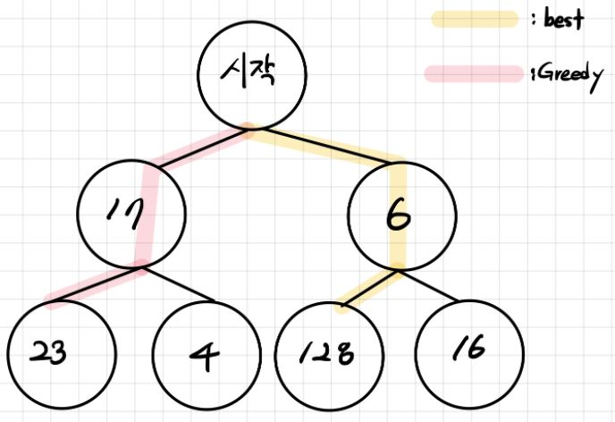

## Greedy(탐욕)알고리즘
    Greedy 알고리즘은 현재 상황에서 가장 좋은 결과를 선택해나가는 방식. 
    하지만 결과는 최적해를 보장해주는 것은 아님.

### Greedy 알고리즘에 현재 상황에서 가장 좋은 결과란?

    가장 큰 수인 128을 찾아야 한다고 가정하자.
    하지만 Greedy 알고리즘을 사용하면 먼저 17을 선택함(6 이랑 비교했을 때 크다고 판단).
    최종 "시작 - 17 - 23" Path가 가장 좋은 것이라고 판단.
    이처럼 Greedy 알고리즘은 현재 상황에서 가장 좋은 결과를 선택하는 방식.

